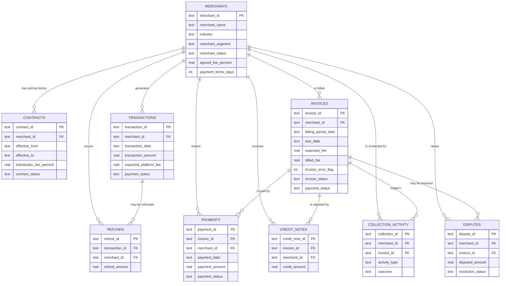

# Database Schema

Entity-relationship diagram for the `finance_ops.db` SQLite database (see `sql/schema.sql` for full DDL).

## Design notes

- **`merchants` is the hub** — every other table hangs off `merchant_id`, matching how a real finance ops team slices everything by account.
- **`contracts` is the pricing history**, separate from the point-in-time `agreed_fee_percent` snapshot on `merchants`. A merchant with a mid-history price change has 2-3 contract rows with non-overlapping `effective_from`/`effective_to` windows; the billing engine (Phase 6) looks up the contract in effect on each transaction's date, which is what makes stale-rate billing errors detectable.
- **`payments.invoice_id` is nullable** — a handful of payments arrive with no invoice reference (orphan/unmatched cash), which is a real reconciliation exception, not a schema bug.
- **`invoices.expected_fee` vs `billed_fee`** is the core billing-accuracy signal: `invoice_error_flag = (billed_fee != expected_fee)`.
- No `ON DELETE CASCADE` is defined — this is an append-only analytical warehouse, not a transactional system; rows are never deleted after load, only appended.
